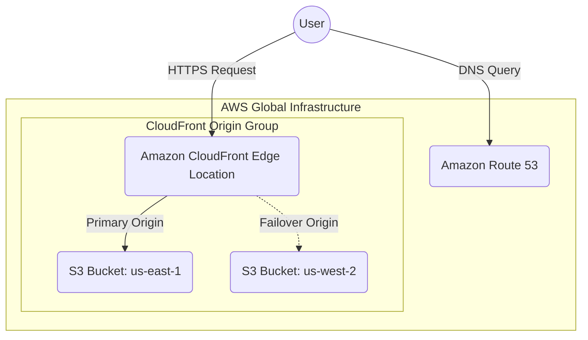

# Zero-Latency 1-Packet Portfolio

This repository contains the Infrastructure-as-Code (IaC) and the aggressively minified source code for a highly resilient, globally distributed personal portfolio website.

The primary goal of this project was extreme optimization: engineering a complete, cloud-native, multi-region portfolio that fits entirely within a **single TCP packet payload**. By keeping the total response size under the standard MTU limit (strictly `< 1400 bytes` to account for TLS overhead), the architecture achieves instant, zero-latency load times by completely avoiding secondary TCP round-trips.

## Architecture

The infrastructure is entirely managed via Terraform and deployed natively on AWS. It utilizes a multi-region active-passive storage backend fronted by a global CDN.



### Architectural Highlights

*   **Single-Packet Payload (< 1400 bytes):** The `index.html` file is stripped of non-essential HTML5 tags (such as `<html>`, `<head>`, and `<body>`) and attribute quotes. By keeping the entire payload size strictly beneath the Maximum Transmission Unit (MTU) threshold, it fits flawlessly within a single TCP packet. This eliminates round-trip wait times during the initial network handshake.
*   **Dual-Region Origin Failover:** The raw HTML is stored in two distinct geographical S3 buckets (`us-east-1` in Virginia and `us-west-2` in Oregon). A CloudFront Origin Group monitors the primary East bucket; if the entire `us-east-1` region experiences an outage, CloudFront instantly and seamlessly routes requests to the West coast bucket.
*   **Strict Security Posture:** Both S3 buckets utilize comprehensive Public Access Blocks. They are secured using modern Origin Access Control (OAC), meaning the buckets can only be read by the specific CloudFront distribution—they are completely inaccessible to the public internet directly.
*   **Global Edge Caching:** Amazon CloudFront handles global distribution, TLS encryption (via an automated ACM certificate), and Brotli compression, serving the portfolio directly from edge PoPs physically closest to the visitor.

## Deployment

The environment is built using HashiCorp Terraform.

```bash
# Initialize Terraform and download the AWS provider
terraform init

# Validate the configuration
terraform validate

# Provision the multi-region architecture
terraform apply
```

*Note: You must have an active AWS account verified for CloudFront deployments. New AWS accounts may require opening a support ticket to lift the default CloudFront quota from 0 to 1.*
